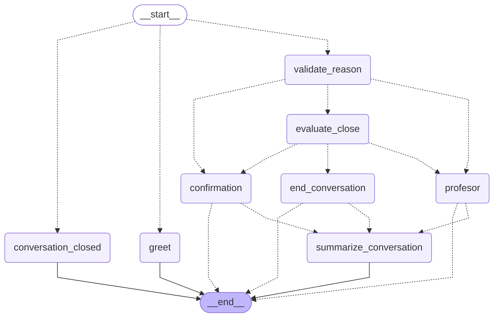

# Workflow del Grafo GerasGraph

```mermaid
---
config:
  flowchart:
    curve: linear
---
graph TD;
	__start__([<p>__start__</p>]):::first
	greet(greet)
	validate_reason(validate_reason)
	evaluate_close(evaluate_close)
	confirmation(confirmation)
	end_conversation(end_conversation)
	conversation_closed(conversation_closed)
	profesor(profesor)
	summarize_conversation(summarize_conversation)
	__end__([<p>__end__</p>]):::last
	__start__ -.-> conversation_closed;
	__start__ -.-> greet;
	__start__ -.-> validate_reason;
	confirmation -.-> __end__;
	confirmation -.-> summarize_conversation;
	end_conversation -.-> __end__;
	end_conversation -.-> summarize_conversation;
	evaluate_close -.-> confirmation;
	evaluate_close -.-> end_conversation;
	evaluate_close -.-> profesor;
	profesor -.-> __end__;
	profesor -.-> summarize_conversation;
	validate_reason -.-> confirmation;
	validate_reason -.-> evaluate_close;
	validate_reason -.-> profesor;
	conversation_closed --> __end__;
	greet --> __end__;
	summarize_conversation --> __end__;
	classDef default fill:#f2f0ff,line-height:1.2
	classDef first fill-opacity:0
	classDef last fill:#bfb6fc

```